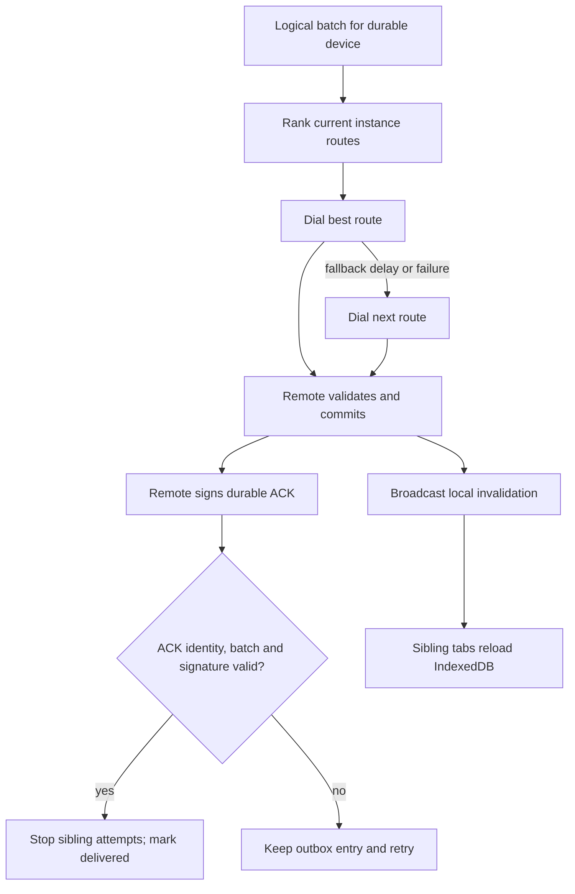

# Replica-aware replication

## Identity and routing

| Name | Durable? | Meaning |
| --- | --- | --- |
| `personId` | yes | Human identity root and authorization subject. |
| `deviceId` | yes | Device certificate and durable delivery target. |
| `replicaId` | yes | Logical replica identifier. Current browser adapters use `deviceId`. |
| `instanceId` | no | One running browser tab or process. |
| `endpoint` | no | Current Iroh address for one instance. |

One device can expose several simultaneous routes. No tab owns the device identity and no tab acts as leader. Every live instance may receive traffic. A durable-device ACK stops redundant delivery after one instance commits the batch. That instance publishes a local invalidation through `BroadcastChannel`; sibling tabs reload committed state from IndexedDB.

Iroh supplies encrypted transport and endpoint reachability. Meta-mesh supplies signed route discovery, device grouping, retries, authorization, durable admission, gossip, and convergence.

## Signed route catalog

`DeviceRoute` binds scope, person, device, instance, endpoint, monotonic sequence, issue time, and expiry. Device key signs the canonical payload. Catalog admission verifies signature, certificate chain, scope authorization, lifetime, and sequence. For equal sequence, deterministic canonical bytes break ties.

Expiry removes an address from dialing candidates. It does not delete the person, device, messages, documents, or authorization. A new instance publishes a higher sequence. Revocation rejects routes signed by the revoked device.

## Contact rendezvous and durable locators

Public contact invitations use durable identity locators (`twang-contact` version 3), decoupling long-lived contact discovery from ephemeral 10-minute `DeviceRoute` leases.

### Lifecycle and trust boundary

1. **Durable locator:** A `ContactLocatorCard` binds the person identity, device certificate, device ID, and a deterministic contact rendezvous endpoint. It is signed by the device key under the `TWANG-CONTACT-LOCATOR/1` domain. Unlike raw `DeviceRoute` links, it does not expire after 10 minutes and contains no private keys.
2. **Deterministic rendezvous:** A 32-byte contact rendezvous seed is derived deterministically from the root `identitySeed` using HKDF-SHA256 with salt `meta-mesh/contact-rendezvous/v1`. Multiple tabs or devices sharing the same identity converge on the same rendezvous endpoint. A browser leader lease ensures a single tab hosts the incoming rendezvous node without endpoint contention.
3. **Idempotent admission:** Incoming contact requests are keyed and deduplicated by `senderPersonId`. Repeated clicks, reconnects, or requests from multiple devices of the same sender update the single existing pending request rather than creating duplicate contacts or duplicate rooms.
4. **Internal route exchange:** Once the recipient accepts the contact request (or if the contact was already established), both peers exchange fresh, signed 10-minute `DeviceRoute` records directly over the secure channel. Short-lived device routes remain strictly internal to active communication.

## Delivery state machine

ACK means the receiving durable device committed admitted changes. Transport success, open connection, presence, and an application response without a valid ACK do not mark delivery complete. Duplicate batches are safe: immutable Automerge change hashes and batch IDs make admission idempotent.

`connectToDevice` and `deliverBatchToDevice` use health-ranked happy-eyeballs. The first route starts immediately; siblings start after the fallback delay or an earlier failure. Losing attempts are aborted. Retry state belongs to route instances; delivery completion belongs to durable devices.

## Automerge anti-entropy

Applications inject one compatible `@automerge/automerge` runtime into `AutomergeAntiEntropy`. Sync state is keyed by document and remote durable device. The wire format carries native incremental sync messages, not whole serialized documents. Admission order:

1. Validate frame bounds, scope, document, sender, and recipient.
2. Verify remote authorization.
3. Apply the native Automerge sync message to a candidate.
4. Run application semantic validation.
5. Persist admitted immutable changes and an explicit-head snapshot.
6. Publish local invalidation.
7. Sign durable ACK.

Reconnect can discard ephemeral sync state. Native Automerge anti-entropy reconstructs missing dependencies and heals partitions from durable document state.

## Sparse gossip

Neighbors are selected per durable device, never per tab. Defaults are low-water 2, target 4, high-water 6, eager fanout 3. Announcements advertise bounded change hashes and heads. Peers request missing hashes and validate each change before admission. Periodic repair exchanges frontiers so missed live pushes converge.

Small meshes can connect fully. Larger meshes keep bounded neighbors and rely on repeated gossip. Offline delivery still requires some later overlap between replicas or an explicitly trusted store-and-forward node. More historical peers alone do not provide delivery when no current path exists.

## Browser lifecycle

Each tab owns its Iroh node, `instanceId`, route lease, and AbortControllers. IndexedDB owns durable documents, changes, outbox claims, route catalog, and device identity. `BroadcastChannel` carries invalidation hints only; durable state remains authoritative.

Each live endpoint gets one reusable outbound Iroh connection per tab. Independent request/response exchanges open separate bidirectional streams on that connection. A transport failure or timeout evicts and closes the pooled connection so the next attempt redials; a verified application rejection leaves the healthy connection reusable. Closing the node closes every pooled connection.

Browser stores discover missing object stores and perform an additive IndexedDB version upgrade. Existing stores and records remain intact. New replica journals may also use a separate database when an application cannot coordinate an upgrade with older deployed tabs.

Closing a tab ends only its route. Other instances for the same device remain valid. A reopened tab publishes a fresh signed route, reloads durable state, and resumes repair. Stale route records may remain for diagnostics until expiry; dial selection ignores expired records.

## Security boundary

- Person roots authorize device certificates.
- Device keys sign routes and durable ACKs.
- Scope grants authorize document access and role.
- Revocation blocks future route admission and document writes.
- Size and count bounds apply before allocation or Automerge admission.
- Ownership and succession records remain application policy until generalized separately; transport cannot grant a role.

Local same-device tabs share storage trust. `BroadcastChannel` is not authenticated and never changes authorization or confirms remote delivery.

## Operational traces

Shared APIs accept a structured trace callback. Stable events:

| Event | Meaning |
| --- | --- |
| `route.attempt` | Dial started for one instance route. |
| `route.failed` | Dial or acceptance failed; includes normalized error. |
| `route.selected` | One instance route won device-level connection. |
| `delivery.route.attempt` | Batch delivery started on a route. |
| `delivery.route.failed` | Route failed or returned invalid ACK. |
| `delivery.ack.durable` | Verified durable-device commit ACK received. |
| `sync.round` | Native Automerge request/response round started. |
| `sync.converged` | Engine has no next frame for the remote device. |

Log device and instance IDs in shortened or hashed form in production UI. Keep full IDs in downloadable diagnostics. Presence should derive from recent successful transport activity. Convergence should derive from sync state and acknowledged heads. These are separate signals.
